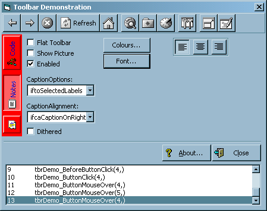



## Advanced VB Based Toolbar ActiveX Control

### Description

This is a complete commericial quality toolbar control for use with VB6 (VB5 users will need to create replacements for Replace and Split functions). It is completly owner drawn, and has no requirements on Common Controls, IE or whatever. As much as possible, API is used to greatly enhance and optimise the control. Buttons can be standard buttons, seperators or placeholders. Each button can have hover and down pictures, as well as alignable caption text. Virtually everything can be customised, include the colors of the toolbar itself.

It also has several other code which would be of use for applications, such as file and colour common dialogs via the API, complete API driven graphics routines, and an extended graphics manipulation class.

Includes complete documentation in the form of a CHM file, code is commented where appropriate as well.

Note: This is advanced code and not really of much use for beginners, although it does include lots of common routines which you could use in your projects, as well as several standard modules.

Vist the Cyotek website at http://www.cyotek.com/ for more ActiveX controls.
 
### More Info
 

             |
---                |---
**Submitted On**   |1999-11-21 14:11:26
**By**             |[Richard Moss](https://github.com/Planet-Source-Code/PSCIndex/blob/master/ByAuthor/richard-moss.md)
**Level**          |Advanced
**User Rating**    |4.9 (161 globes from 33 users)
**Compatibility**  |VB 5\.0, VB 6\.0
**Category**       |[OLE/ COM/ DCOM/ Active\-X](https://github.com/Planet-Source-Code/PSCIndex/blob/master/ByCategory/ole-com-dcom-active-x__1-29.md)
**World**          |[Visual Basic](https://github.com/Planet-Source-Code/PSCIndex/blob/master/ByWorld/visual-basic.md)
**Archive File**   |[CODE\_UPLOAD3209222000\.zip](https://github.com/Planet-Source-Code/richard-moss-advanced-vb-based-toolbar-activex-control__1-5839/archive/master.zip)

